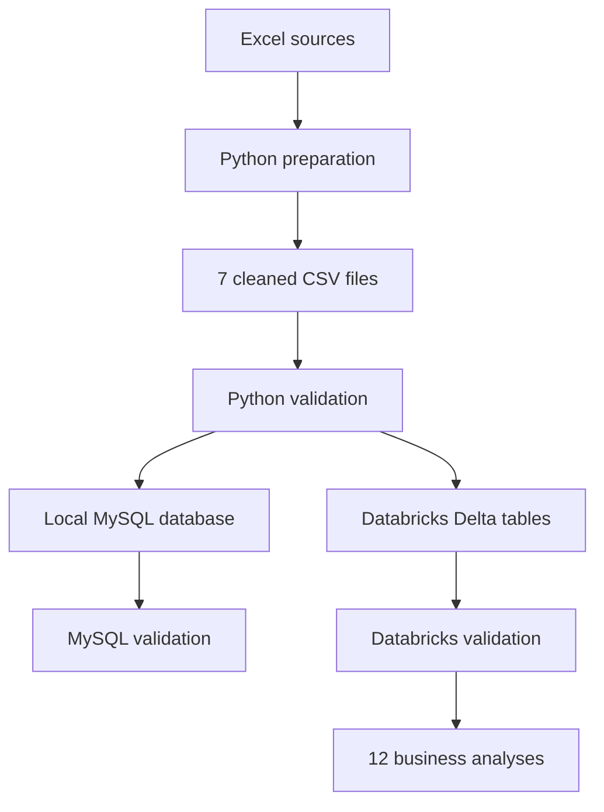
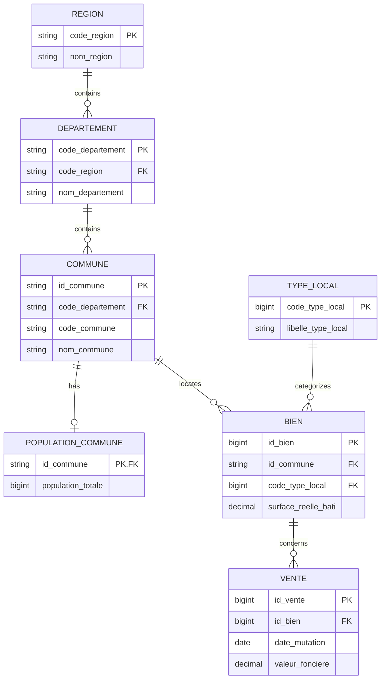

<p align="center">
  
</p>

<p align="center">
  Real estate data preparation, 3NF relational modeling,<br>
  and SQL analysis with MySQL and Databricks
</p>

<p align="center">
  
  
  
  
  
</p>

<p align="center">
  <a href="https://stephane-oc.github.io/data-immo/">
    
  </a>
</p>


---

## Overview

**DATAImmo** is a data analysis project based on French real estate, demographic, and geographic data.

Its purpose is to transform three source data files, together with descriptive guide, into a normalized and documented relational database that can answer twelve real estate market analysis questions.

The project uses two complementary SQL environments:

- **MySQL** to create, import, and validate relational model locally
- **Databricks** as primary environment for hosting, validating, and analyzing final datasets

Project includes:

- Data cleaning and transformation with Python and Pandas
- Removal of buyer-identifying information from cleaned datasets
- Reneration and validation of seven cleaned CSV files
- Data dictionary covering source data and all 33 final fields
- Relational model normalized to third normal form (3NF)
- MySQL database with seven primary keys and six foreign keys
- Automated imports and SQL validation in MySQL
- Seven Delta tables hosted in Databricks
- Informational constraints declared in Unity Catalog
- Twelve business-oriented SQL queries
- Databricks notebook used as a presentation and demonstration resource

## Objectives

- Identify variables required for requested analyses
- Build clear and normalized relational model
- Preserve leading zeros in geographic and postal codes
- Apply data minimization principle
- Validate row counts, keys, and referential integrity
- Reproduce same seven-table model in MySQL and Databricks
- Deliver SQL analyses that are understandable to business stakeholders

## Source Data

The preparation workflow uses following resources from `data/raw/`:

| File | Content | Purpose |
|---|---|---|
| `Valeurs-foncières.xlsx` | DVF real estate transactions from first half of 2020 | Builds property and sale datasets |
| `donnees_communes.xlsx` | Municipal population data | Builds `population_commune` |
| `fr-esr-referentiel-geographique.xlsx` | Regions, departments, and municipalities | Builds geographic reference tables |
| `DAN-P3-notice-descriptive-du-fichier-dvf.pdf` | DVF variable descriptions | Supports data understanding and variable selection |

> [!NOTE]
> Identities included in educational workbook are fictitious. They are nevertheless excluded from seven cleaned CSV files because they are not required for analyses. Final relational model therefore contains no buyer first or last names.

## Pipeline Overview



## CSV Preparation and Validation

### 1. Generate the Cleaned CSV Files

Run the following command from the project root:

```bash
python scripts/01_prepare_clean_csv.py
```

The script:

- Reads three source Excel workbooks
- Selects only variables required for project
- Standardizes geographic codes
- Preserves codes as text to retain their leading zeros
- Excludes buyer-identifying information
- Builds seven tables in final model
- Writes resulting files to `data/clean/`

### 2. Validate Cleaned CSV Files

```bash
python scripts/02_verify_clean_csv.py
```

Validation workflow checks:

- Presence of all seven expected files
- Names and order of all 33 columns
- Expected row counts
- Uniqueness and completeness of all seven future primary keys
- Absence of orphaned values across six relationships
- Validity and range of transaction dates
- Presence of expected `Maison` and `Appartement` property types
- Absence of buyer-related columns

Script generates two validation reports in `reports/`:

```text
clean_csv_row_counts.csv
clean_csv_verification_report.txt
```

## Final Relational Model

Final 3NF model contains **7 tables**, **33 fields**, **7 primary keys**, and **6 foreign keys**.

Following diagram shows main fields and relationships. Data dictionary and full relational schema document all 33 fields in detail.



Related documentation:

- [`Dictionnaire_donnees_DATAImmo.xlsx`](docs/Dictionnaire_donnees_DATAImmo.xlsx)
- [`schema_relationnel_dataimmo_3nf.pdf`](docs/schema_relationnel_dataimmo_3nf.pdf)

### Tables and Keys

| Table | Purpose | Primary Key | Foreign Keys |
|---|---|---|---|
| `region` | Region reference data | `code_region` | — |
| `departement` | Department reference data | `code_departement` | `code_region` |
| `commune` | Municipality reference data | `id_commune` | `code_departement` |
| `population_commune` | Municipality population data | `id_commune` | `id_commune` |
| `type_local` | Property type reference data | `code_type_local` | — |
| `bien` | Property characteristics and location | `id_bien` | `id_commune`, `code_type_local` |
| `vente` | Real estate transactions | `id_vente` | `id_bien` |

`id_commune` is the normalized concatenation of department code and municipality code. It therefore represents same concept as `id_codedep_codecommune` composite key described in project requirements.

### Cardinalities

- One region contains multiple departments
- One department contains multiple municipalities
- One municipality has zero or one population record
- One municipality may contain multiple properties
- One property type may describe multiple properties
- One property may be associated with multiple sales

### Main Data Types

| Category | Databricks | MySQL |
|---|---|---|
| Technical identifiers | `BIGINT` | `BIGINT UNSIGNED` |
| Geographic and postal codes | `STRING` | `VARCHAR` |
| Population values | `BIGINT` | `BIGINT UNSIGNED` |
| Dates | `DATE` | `DATE` |
| Surface areas | `DECIMAL(10,2)` | `DECIMAL(10,2)` |
| Property values | `DECIMAL(14,2)` | `DECIMAL(14,2)` |
| Labels | `STRING` | `VARCHAR` |

Codes remain text values in both environments to preserve leading zeros, such as `06`, `01001`, and `01000`.

## Validated Row Counts

| Table | Row Count |
|---|---:|
| `region` | 19 |
| `departement` | 109 |
| `commune` | 38,916 |
| `population_commune` | 34,991 |
| `type_local` | 2 |
| `bien` | 34,169 |
| `vente` | 34,169 |

The Python, MySQL, and Databricks validation workflows confirm:

- Seven unique and non-null primary keys
- Six relationships without orphaned rows
- Matching row counts across CSV files and both SQL environments
- Transaction period from January 2 through June 30, 2020
- Only expected property types
- No buyer-identifying columns in final model

## MySQL Workflow

MySQL provides a complete local implementation of model. It creates database with enforced constraints, automatically imports seven cleaned CSV files, and validates result in MySQL Workbench.

### Execution Order

> [!CAUTION]
> `01_creation_bdd_DATAImmo.sql` drops and fully recreates `dataimmo` database. Any existing data in that database will be deleted.

1. Generate and validate CSV files with two Python scripts described above.
2. Run `sql/mysql/01_creation_bdd_DATAImmo.sql` in MySQL Workbench.
3. Import the seven CSV files from project root:

   ```powershell
   python scripts/03_import_clean_csv_mysql.py --user root
   ```

4. Run `sql/mysql/02_verifications_mysql.sql` in MySQL Workbench.
5. Confirm that every summary check returns `OK`.

Import script supports the following command-line options:

```text
--host
--port
--user
--password
--database
--no-reset
--chunk-size
```

### MySQL Files

| File | Purpose |
|---|---|
| `sql/mysql/01_creation_bdd_DATAImmo.sql` | Recreates `dataimmo` and defines 7 tables, 33 columns, 7 primary keys, 6 foreign keys, and supporting indexes |
| `scripts/03_import_clean_csv_mysql.py` | Validates CSV columns and imports all 7 files in dependency order |
| `sql/mysql/02_verifications_mysql.sql` | Validates structure, row counts, keys, relationships, dates, property types, and data minimization requirements |

In MySQL, primary keys, foreign keys, `NOT NULL` constraints, and referential rules are enforced by InnoDB storage engine.

## Databricks Workflow

Databricks is the primary environment for hosting, validating, and analyzing project data.

Seven CSV files from `data/clean/` are imported into:

```text
workspace.dataimmo
```

The resulting Delta tables are created from semicolon-delimited files that include a header row.

### Execution Order

> [!CAUTION]
> `01_creation_schema_databricks.sql` uses `DROP SCHEMA ... CASCADE`. It deletes `dataimmo` schema and all of its tables before recreating it.

1. Run `sql/databricks/01_creation_schema_databricks.sql`.
2. Manually import seven CSV files with **Add data**, following order documented in script.
3. Run `sql/databricks/02_verifications_nombres_databricks.sql`.
4. Run `sql/databricks/03_verifications_doublons_databricks.sql`.
5. Run `sql/databricks/04_verifications_integrite_databricks.sql`.
6. Confirm that every status is `OK` and that buyer-column check returns no rows.
7. Run `sql/databricks/05_declaration_contraintes_databricks.sql` once.
8. Run `sql/databricks/06_requetes_metier_databricks.sql`.
9. Present validation results and business analyses in Databricks notebook.

### Databricks Files

| File | Purpose | Expected Result |
|---|---|---|
| `01_creation_schema_databricks.sql` | Resets `workspace.dataimmo` and documents seven-file import process | An empty schema ready for import |
| `02_verifications_nombres_databricks.sql` | Compares CSV and Databricks row counts | 7 `OK` statuses |
| `03_verifications_doublons_databricks.sql` | Checks future primary keys for null values and duplicates | 0 issues and 7 `OK` statuses |
| `04_verifications_integrite_databricks.sql` | Validates 6 relationships and checks for buyer-related columns | 0 orphaned rows and no privacy-check results |
| `05_declaration_contraintes_databricks.sql` | Sets primary key columns to `NOT NULL` and declares 7 primary keys and 6 foreign keys | 13 constraints and an `OK` status |
| `06_requetes_metier_databricks.sql` | Runs 12 official business analyses | Usable business results |

### Databricks Constraints

Primary and foreign keys are declared in Unity Catalog with `NOT ENFORCED`. They document relational model, but Databricks does not automatically prevent duplicates or orphaned rows.

Files 02, 03, and 04 therefore validate data before constraints are declared. File 05 must be run once on freshly recreated tables because running it again would attempt to declare constraints that already exist.

## Business Analyses

The twelve SQL queries answer following questions:

1. How many apartments were sold during first half of 2020?
2. How many apartment sales were recorded in each region?
3. What proportion of apartment sales falls into each room-count category?
4. Which ten departments have highest average price per square meter?
5. What is average price per square meter for a house in Île-de-France region?
6. Which ten apartments have highest sale values, and what are their regions and surface areas?
7. How did number of sales change between first and second quarters of 2020?
8. How do regions rank by average price per square meter of apartments with more than four rooms?
9. Which municipalities recorded at least fifty sales during first quarter of 2020?
10. What is difference in average price per square meter between two-room and three-room apartments?
11. Which three municipalities have highest average property value in each of following departments: 06, 13, 33, 59, and 69?
12. Which twenty municipalities with more than 10,000 residents have highest number of transactions per 1,000 residents?

Databricks notebook brings together validation checks, all twelve queries, and their results.

## Local Installation

### Prerequisites

- Python 3.10 or later
- `pip`
- MySQL 8 and MySQL Workbench to reproduce local MySQL workflow
- Databricks access with Unity Catalog to reproduce final workflow

### Python Environment

```powershell
python -m venv .venv
.\.venv\Scripts\Activate.ps1
python -m pip install --upgrade pip
pip install pandas openpyxl mysql-connector-python
```

### Complete Local Workflow

```powershell
python scripts/01_prepare_clean_csv.py
python scripts/02_verify_clean_csv.py
```

After creating database with `sql/mysql/01_creation_bdd_DATAImmo.sql`, run:

```powershell
python scripts/03_import_clean_csv_mysql.py --user root
```

Database credentials can be provided through command-line options. No password should ever be written directly into a version-controlled file.

## Data Privacy and Publication

Project follows data minimization principle: fictitious first and last names included in educational source file are never propagated to `data/clean`, MySQL, or Databricks.

Repository may include educational source files that are authorized for redistribution. However, if those files are replaced with real or confidential data, they must be excluded from repository.

## Technologies

- Python and Pandas
- SQL
- MySQL 8 and MySQL Workbench
- Databricks SQL, Unity Catalog, and Delta tables
- Visual Studio Code
- Git and GitHub

## Author

Project created by **Stephane-OC** as part of data analysis training program.